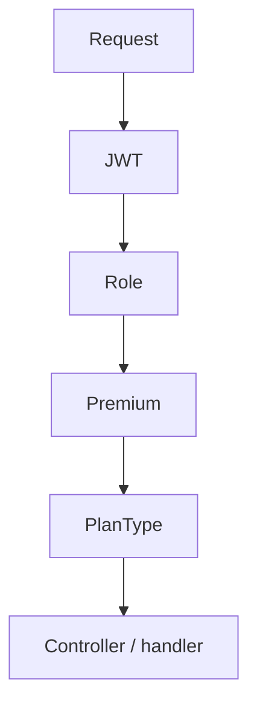

# 💳 Billing & Controle Premium

Documentação da API (`services/api`): **Stripe** (checkout, webhooks, assinatura) e **controle de acesso premium** (`plan`, `planType`, `role`).

Checklist por fases (raiz do repo): [`docs/MONETIZATION-CHECKLIST.md`](../../../docs/MONETIZATION-CHECKLIST.md).

**Webhooks Stripe (Fase 3):** matriz de eventos, idempotência, logs e testes manuais — [`docs/STRIPE-EVENTS-VALIDATION.md`](../../../docs/STRIPE-EVENTS-VALIDATION.md).

## 🎯 Objetivo

Controlar acesso às funcionalidades premium do sistema com base em:

- **Plano** (`plan`)
- **Tipo de plano** (`planType`)
- **Role** do usuário (`role`)

---

## 🧠 Conceitos

### Plan

| Valor   | Significado                |
|---------|----------------------------|
| `FREE`  | Usuário sem acesso premium |
| `PREMIUM` | Usuário com acesso pago  |

### PlanType

| Valor      | Significado                          |
|------------|--------------------------------------|
| `ALUNO`    | Plano premium para aluno             |
| `PERSONAL` | Plano premium para personal          |
| `null`     | Usuário free (sem tipo de plano pago) |

### Role

| Valor                 | Significado        |
|-----------------------|--------------------|
| `PERSONAL_PROFESSOR`  | Conta de personal  |
| `ALUNO`               | Conta de aluno     |

---

## 🔐 Estrutura de proteção

Ordem **obrigatória** dos guards (ex.: `AiController`; replique o mesmo padrão em outras rotas premium):

```ts
@UseGuards(JwtAuthGuard, RolesGuard, PremiumGuard, PlanTypeGuard)
```

1. **`JwtAuthGuard`** — autentica e preenche `req.user` (incl. `plan`, `planType`, `role`).
2. **`RolesGuard`** — valida `@Roles(...)` no handler.
3. **`PremiumGuard`** — exige `PREMIUM` quando há `@RequirePremium()` (opcional por rota).
4. **`PlanTypeGuard`** — exige `PREMIUM` + `planType` quando há `@RequirePlanType(PERSONAL | ALUNO)`.

**Decorators:** `@RequirePremium()`, `@RequirePlanType('PERSONAL' | 'ALUNO')`, `@Roles(...)`.

### Responsabilidades (resumo)

| Guard | Função |
|--------|--------|
| `JwtAuthGuard` | Autenticação (JWT válido → `req.user`) |
| `RolesGuard` | Valida **role** exigida na rota (`ALUNO` / `PERSONAL_PROFESSOR`, conforme `@Roles`) |
| `PremiumGuard` | Valida `plan === PREMIUM` quando há `@RequirePremium()` |
| `PlanTypeGuard` | Valida `plan === PREMIUM` e **planType** correto (`@RequirePlanType`) |

### Fluxo de autorização

Sequência até o handler (mesma ordem do `@UseGuards`):



### Regras de bloqueio (camada de guards)

| Situação | Resultado típico |
|----------|-------------------|
| Sem token / JWT inválido | **401** |
| Role inválida para a rota | **403** |
| Plano FREE (quando a rota exige premium / planType) | **403** |
| `planType` incorreto para a rota | **403** |
| Passou todos os guards | Handler executa — resposta pode ser **200** ou erro **posterior** (ex.: `OPENAI_API_KEY` ausente em rota de IA) |

### Integração com Stripe (atualização de plano)

- **Webhooks** Stripe (eventos de assinatura / invoice)
- **Sync manual:** `POST /v1/billing/subscription/sync` (JWT)
- **Checkout:** `POST /v1/billing/checkout-session` (JWT)

Campos em `User` / assinatura costumam refletir: `plan`, `planType`, `stripeSubscriptionId`, status da assinatura (via tabela `Subscription` + Stripe).

Detalhes por rota (IA), mensagens 403 e matriz Swagger: secção [**Premium — IA / autorização**](#premium--ia--autorização).

---

## Stripe e operações

### Migração

Na pasta `services/api`:

```bash
npx prisma migrate deploy
```

ou (dev):

```bash
npx prisma migrate dev
```

Depois:

```bash
npx prisma generate
```

### Variáveis `.env`

- `STRIPE_SECRET_KEY`
- `STRIPE_PUBLIC_KEY`
- `STRIPE_PERSONAL_PRICE_ID`
- `STRIPE_ALUNO_PRICE_ID`
- `STRIPE_WEBHOOK_SECRET` (use o `whsec_` do `stripe listen` em local)
- `WEB_URL` / `APP_URL_WEB`

### Rotas

| Método | Rota | Auth | Descrição |
|--------|------|------|-----------|
| POST | `/v1/billing/checkout-session` | JWT | Cria Checkout Session |
| GET | `/v1/billing/subscription/me` | JWT | Plano + assinatura atual (`stripeSubscriptionId`, períodos, etc.) |
| POST | `/v1/billing/subscription/cancel` | JWT | Cancela na Stripe (padrão `cancel_at_period_end`; `{"immediately":true}` opcional). Payload amigável + `nextSteps`. |
| POST | `/v1/billing/subscription/sync` | JWT | `retrieve` na Stripe e alinha DB + `users` |
| POST | `/v1/billing/customer-portal` | JWT | `{ "returnUrl"?: "..." }` ou vazio — URL do Stripe Billing Portal |
| GET | `/v1/health` | — | Healthcheck (deploy) |
| POST | `/v1/stripe/webhook` | Stripe signature | Webhooks (body raw) |

### Ciclo de vida (webhooks)

| Evento | Comportamento resumido |
|--------|-------------------------|
| `checkout.session.completed` | Correlaciona `userId` via `client_reference_id`, metadata da session ou da subscription; `retrieve` da subscription; upsert + sync premium. |
| `customer.subscription.created` | Upsert completo; fallback de `userId` por `stripeCustomerId` em assinatura anterior; sync `users.plan/planType`. |
| `customer.subscription.updated` | Upsert de campos mutáveis; premium mantido se status em `trialing/active/past_due/paused`; revogado se `canceled/unpaid/incomplete_expired`. |
| `customer.subscription.deleted` | `CANCELED` + `canceledAt`; usuário `FREE` / `planType` null. |
| `invoice.payment_succeeded` | `retrieve` subscription; upsert períodos/status; sync premium. |
| `invoice.payment_failed` | `retrieve` subscription; upsert; se Stripe indica suspensão real → revoga premium; se ainda `active` → marca DB `PAST_DUE` e mantém premium até próximo evento. |

Mapeamentos centralizados: `src/billing/utils/stripe-maps.ts` (`mapStripeSubscriptionStatus`, `resolveSubscriptionPlanType`, `stripeStatusKeepsPremium`, `stripeStatusShouldRevokePremium`).

### Webhook local (Stripe CLI)

Terminal 1 — API:

```bash
npm run dev
```

Terminal 2:

```bash
stripe listen --forward-to localhost:3001/v1/stripe/webhook
```

Copie o **Signing secret** para `STRIPE_WEBHOOK_SECRET` e reinicie a API.

Terminal 3 — eventos de teste:

```bash
stripe trigger checkout.session.completed
stripe trigger customer.subscription.updated
```

### Swagger — checkout

1. `POST /v1/auth/login` (ex.: `personal@ironbody.app` / `senha123`)
2. Authorize com o `accessToken`
3. `POST /v1/billing/checkout-session`:

```json
{
  "plan": "PERSONAL",
  "successUrl": "http://localhost:3001/v1/docs",
  "cancelUrl": "http://localhost:3001/v1/docs"
}
```

### Modelo de dados (billing)

- **User**: `plan` (FREE | PREMIUM), `planType` (PERSONAL | ALUNO | null)
- **Subscription**: status Stripe mapeado, períodos, trial, `stripePriceId`, etc.
- **StripeWebhookEvent**: idempotência (evita reprocessar o mesmo `evt_`)

### Conferência: logs do webhook + tabelas `Subscription` e `User`

#### 1) Logs no terminal da API

No processo onde roda `npm run start:dev`, o `StripeController` registra:

| Situação | Log (Nest) |
|----------|------------|
| Evento novo aceito | `Webhook <tipo> (<evt_...>)` |
| Processamento OK + gravado no banco | `Webhook processado e idempotência gravada: <tipo> (<evt_...>)` |
| Evento já processado antes | `Webhook duplicado ignorado: <evt_...>` |
| Falha na assinatura / body | resposta 400 (ex.: verificação de assinatura) |
| Erro ao processar handler | `Erro ao processar webhook <tipo>: ...` |

**Importante:** a linha na tabela `StripeWebhookEvent` só é criada **depois** do handler terminar sem erro. Se aparecer erro no log, confira `STRIPE_WEBHOOK_SECRET` (deve bater com o `whsec_` do `stripe listen`) e o body raw do webhook.

#### 2) Prisma Studio (ver `subscriptions`, `users`, webhooks)

Na pasta `services/api`:

```bash
npx prisma studio
```

Abra no browser (geralmente `http://localhost:5555`) e use:

| Tabela | O que conferir |
|--------|----------------|
| **User** | `email`, `plan` (`FREE` / `PREMIUM`), `planType` (`PERSONAL` / `ALUNO` / vazio) |
| **Subscription** | `userId`, `stripeCustomerId`, `stripeSubscriptionId`, `stripePriceId`, `planType`, `status`, `currentPeriodStart` / `End`, trial, `cancelAtPeriodEnd` |
| **StripeWebhookEvent** | `id` (= id do evento Stripe `evt_...`), `type` (ex.: `checkout.session.completed`), `createdAt` |

Filtre **User** pelo e-mail do teste (`personal@ironbody.app` / `aluno@ironbody.app`) e veja se há **Subscription** com o mesmo `userId`.

#### 3) Via API (usuário logado)

- `GET /v1/billing/subscription/me` (JWT) — retorno espelha plano/assinatura do usuário autenticado.

#### 4) Terminal do Stripe CLI

O `stripe listen` mostra cada evento encaminhado e o status HTTP da sua API (`200` = recebido; se a API lançar 500 após processar, o Stripe pode retentar).

## Premium — IA / autorização

`POST /v1/ai/workout/generate` exige:

- role `PERSONAL_PROFESSOR`
- `plan === PREMIUM` e `planType === PERSONAL` (`@RequirePlanType(PERSONAL)` + `PlanTypeGuard`)

`POST /v1/ai/nutrition/meal-photo` (stub) exige:

- role `ALUNO`
- `plan === PREMIUM` e `planType === ALUNO`

Ordem dos guards e papel de cada um: [**Estrutura de proteção**](#estrutura-de-proteção) (inclui o snippet `@UseGuards(...)`).

**Decorators** (complemento às rotas): `@RequirePremium()`, `@RequirePlanType('PERSONAL' | 'ALUNO')`, `@Roles(...)`.

Mensagens 403: `Plano premium necessário`, `Plano PERSONAL premium necessário`, `Plano ALUNO premium necessário`.

### Matriz validada no Swagger (Fase 1.1)

Rota: **`POST /v1/ai/workout/generate`** (Personal + Premium Personal).

| Cenário (teste) | `plan` | `planType` | role | Resultado esperado | Observação |
|-----------------|--------|------------|------|-------------------|------------|
| aluno.free | FREE | null | ALUNO | **403** | `RolesGuard` — não é personal |
| aluno.premium | PREMIUM | ALUNO | ALUNO | **403** | idem |
| personal.free | FREE | null | PERSONAL_PROFESSOR | **403** | `PlanTypeGuard` — exige PREMIUM + PERSONAL |
| personal.premium | PREMIUM | PERSONAL | PERSONAL_PROFESSOR | **Passa os guards** | Resposta pode ser **4xx/5xx** depois (ex.: `OPENAI_API_KEY` ausente em `AiService`) — isso **não** invalida a proteção premium |

**Observação (personal.premium):** a requisição **passou pelos guards** corretamente; falha **depois** por serviço de IA (ex.: `OPENAI_API_KEY` não configurada) → **controle de acesso OK**; configurar a chave é responsabilidade do **serviço de IA**, não do guard premium.

Para obter **200** real nessa rota, além do cenário `personal.premium`, configure `OPENAI_API_KEY` (e modelo, se aplicável) no `.env`.
